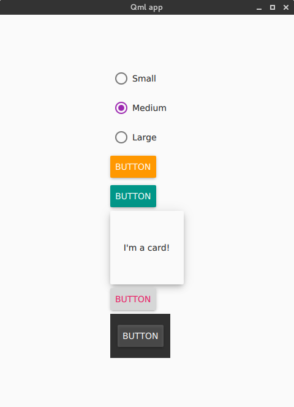

PyQt Material Qml
===========

### UPDATE: In [this answer](https://stackoverflow.com/a/48583334/6622587) you can find other methods to enable the material design style of QML from python.

_______________________________________________________

- PyQt 5.8

You must create a file named qtquickcontrols2.conf with the following content:


	; This file can be edited to change the style of the application
	; See Styling Qt Quick Controls 2 in the documentation for details:
	; http://doc.qt.io/qt-5/qtquickcontrols2-styles.html
	
	[Controls]
	Style=Material


Then you need to create a resource called resource.qrc that contains the following:

	<RCC>
	    <qresource prefix="/">
	        <file>qtquickcontrols2.conf</file>
	    </qresource>
	</RCC>

And convert it to python code by executing the following command:

	pyrcc5 resource.qrc -o resource_rc.py


Then we implemented the qml and python file where we imported resource_rc. For Example:

**main.qm**l

```js
import QtQuick 2.3
import QtQuick.Controls 2.1
import QtQuick.Window 2.2
import QtQuick.Controls.Material 2.1 

ApplicationWindow{
    title: qsTr('Qml app')
    id: mainWindow
    width:  480
    height: 640
    visible: true
    Material.theme: Material.Light
    Material.accent: Material.Purple

    Column {
        anchors.centerIn: parent

        RadioButton { text: qsTr("Small") }
        RadioButton { text: qsTr("Medium");  checked: true }
        RadioButton { text: qsTr("Large") }

        Button {
            text: qsTr("Button")
            highlighted: true
            Material.accent: Material.Orange
        }
        Button {
            text: qsTr("Button")
            highlighted: true
            Material.background: Material.Teal
        }

        Pane {
            width: 120
            height: 120

            Material.elevation: 6

            Label {
                text: qsTr("I'm a card!")
                anchors.centerIn: parent
            }
        }

        Button {
            text: qsTr("Button")
            Material.foreground: Material.Pink
        }

        Pane {
            Material.theme: Material.Dark

            Button {
                text: qsTr("Button")
            }
        }

        Rectangle {
            color: Material.color(Material.Red)
        }
   	} 
}
```

**main.py**

```python

from PyQt5.QtWidgets import *
from PyQt5.QtQml import *
from PyQt5.QtCore import *

import sys
import resource_rc

if __name__ == '__main__':
	app = QApplication(sys.argv)
	engine = QQmlApplicationEngine()
	engine.load(QUrl('main.qml'))

	sys.exit(app.exec_())
	
```

Obtaining at the end the following structure:

	.
	├── main.py
	├── main.qml
	├── qtquickcontrols2.conf
	├── README.md
	├── resource.qrc
	└── resource_rc.py


Screenshot:

